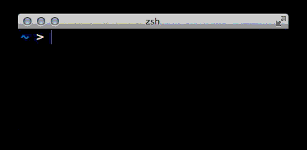

sleep
=====

`sleep` with a countdown timer

Usage
-----

    $ sleep <seconds>

Installation
------------

Add `sleep` to your `$PATH`.

Meta
----

Written by [Maciej Konieczny](http://narf.pl/) and released into
public domain.
